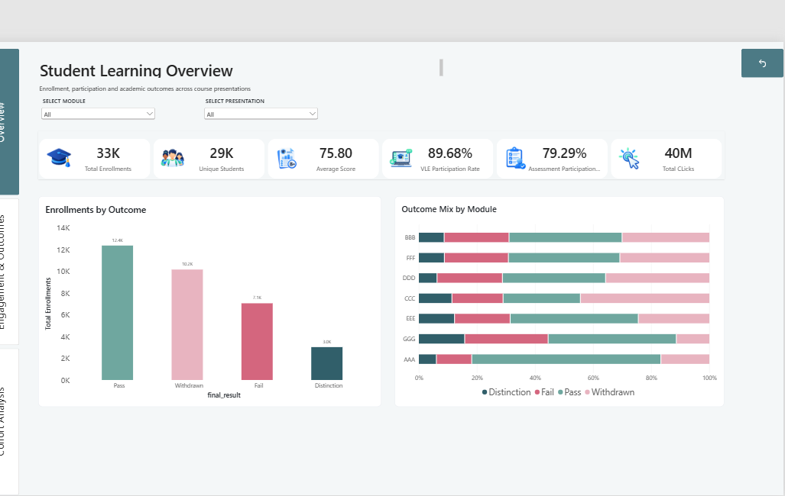
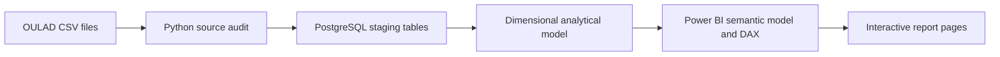
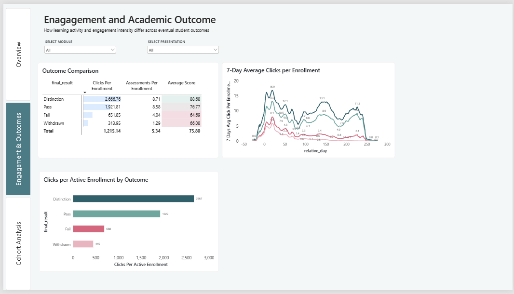
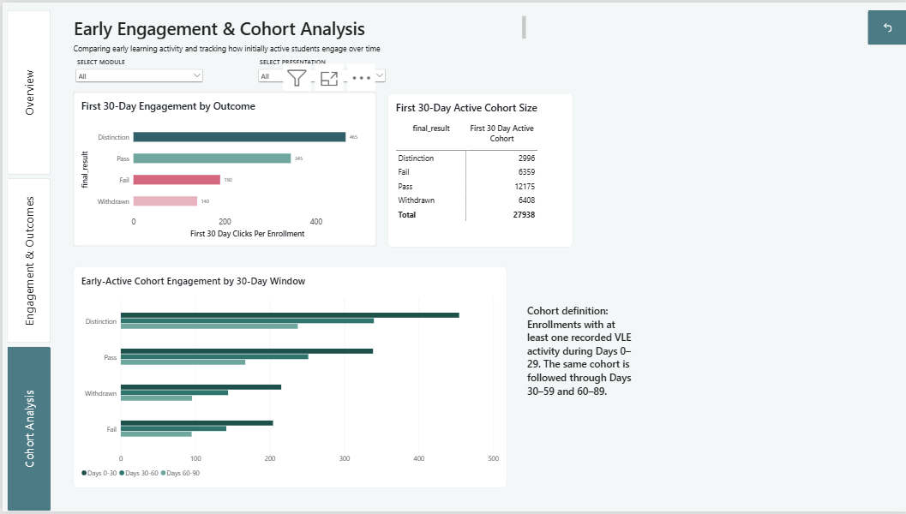

# Student Learning Analytics

An end-to-end analytics portfolio project built on the Open University Learning Analytics Dataset (OULAD). Raw course, enrollment, assessment, and virtual learning environment (VLE) data is profiled in Python, modeled in PostgreSQL, and presented through an interactive Power BI report.



## Project summary

The report helps answer three questions:

1. How are enrollments distributed across Pass, Distinction, Fail, and Withdrawn outcomes?
2. How strongly do learning activity and assessment participation differ by final outcome?
3. Can engagement in the first 30 days provide an early signal of later academic performance?

The final semantic model covers:

- **32,593 enrollments** across 22 module presentations
- **28,785 unique students** and seven modules
- **173,912 assessment submissions**
- **10.66 million raw VLE activity rows**, summarized into an analysis-ready fact table
- **40 million recorded clicks** in the report model

## Analytics workflow



The Python notebook checks schemas, missing values, duplicates, and candidate business keys. PostgreSQL separates the raw source structure from an analytical star schema. Power BI imports that model, adds reusable DAX measures, and exposes module and presentation filters across three report pages.

## Dimensional model

The Power BI model contains two fact tables, five business dimensions, a relative-day helper dimension, and a dedicated measures table.

| Layer | Tables | Purpose |
|---|---|---|
| Facts | `fact_vle_activity`, `fact_assessment_taken` | Learning activity and assessment performance |
| Dimensions | `dim_student`, `dim_enrollment`, `dim_course_presentation`, `dim_assessment`, `dim_vle_resource` | Descriptive context and filtering |
| Time helper | `dim_relative_day` | Consistent analysis of activity before and after module start |
| Measures | `_Measures` | Centralized DAX KPIs and cohort calculations |

See [Dimensional model and metric definitions](docs/data-model.md) for the grain, relationship map, and reporting logic.

## Report pages

### 1. Overview

Executive KPIs and outcome distribution, with comparisons across modules and course presentations.


### 2. Engagement & Outcomes

Compares clicks, assessment participation, and average scores by final result, then tracks seven-day average click activity across the course timeline.



### 3. Cohort Analysis

Defines an early-active cohort using at least one recorded VLE interaction during days 0–29, then follows the same enrollments through days 30–59 and 60–89.



## Key findings

- **Engagement separates outcomes clearly.** Distinction enrollments average about 2,667 clicks, compared with 1,922 for Pass, 652 for Fail, and 314 for Withdrawn.
- **Assessment participation follows the same pattern.** Distinction and Pass enrollments complete roughly 8.7 assessments on average, while Fail and Withdrawn enrollments complete about 4.0 and 1.3.
- **Early activity is informative.** First-30-day clicks average 465 for Distinction, 345 for Pass, 190 for Fail, and 140 for Withdrawn.
- **Participation declines over time for every outcome group**, but Distinction and Pass cohorts maintain materially higher activity through the 30–59 and 60–89 day windows.
- **Withdrawal is a major lifecycle outcome.** Roughly 10.2K of 32.6K enrollments are withdrawn, making early engagement monitoring operationally relevant.

These are descriptive associations, not causal claims or a predictive model.

## Repository structure

```text
.
├── docs/
│   ├── data-model.md
│   └── images/
├── notebooks/
│   └── 01-source-audit.ipynb
├── powerbi/
│   ├── internship-lifecycle-analytics.pbix
│   ├── README.md
│   └── themes/
│       └── sannan-power-bi-portfolio-theme.json
├── .gitignore
└── README.md
```

## Using the project

1. Review `notebooks/01-source-audit.ipynb` to understand the source tables and data-quality checks. The raw CSV files are intentionally excluded from Git.
2. Read `docs/data-model.md` for the PostgreSQL-to-Power BI analytical design.
3. Open `powerbi/internship-lifecycle-analytics.pbix` in Power BI Desktop on Windows.
4. Import `powerbi/themes/sannan-power-bi-portfolio-theme.json` to reuse the report styling in another Power BI file.

The PBIX includes an imported model snapshot for portfolio review. Refreshing the model requires a compatible PostgreSQL database and local connection settings; credentials are not included.

## Data source and privacy

This project uses the anonymized [Open University Learning Analytics Dataset](https://research.stem.open.ac.uk/ouanalyse/dataset/). The dataset is described in Kuzilek, Hlosta, and Zdrahal (2017), *Open University Learning Analytics dataset*, [Scientific Data 4, 170171](https://doi.org/10.1038/sdata.2017.171).

Raw source files, processed extracts, local Power BI caches, environment files, and credentials are excluded from version control.
