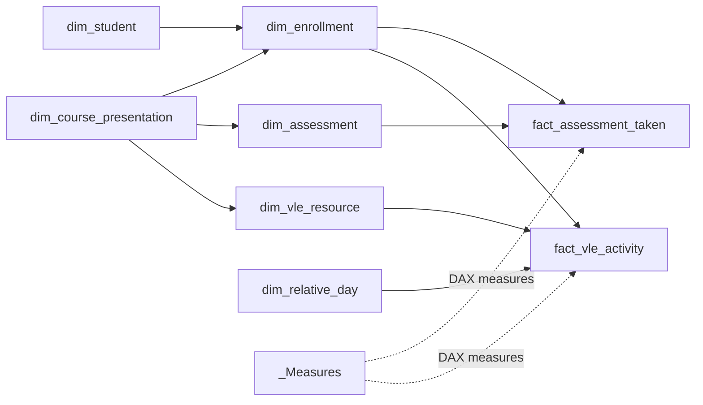

# Dimensional model and metric definitions

## Design goals

The analytical model separates reusable descriptive dimensions from high-volume learning activity and assessment facts. This keeps filtering predictable, avoids double-counting enrollments, and supports measures at enrollment, assessment, and relative-day grains.

## Logical relationship map

Filters flow from dimensions to facts. Enrollment is the central analytical entity because the same student can appear in more than one module presentation and can have a different outcome on each attempt.

## Table catalog

| Table | Grain | Reporting role |
|---|---|---|
| `dim_student` | One row per anonymized student | Stable student descriptors used for segmentation |
| `dim_enrollment` | One row per student and module presentation | Final result, attempt-level attributes, and the denominator for enrollment KPIs |
| `dim_course_presentation` | One row per module presentation | Module/presentation slicers and course duration |
| `dim_assessment` | One row per assessment | Assessment type, due day, and weight |
| `dim_vle_resource` | One row per VLE resource in a presentation | Learning-resource and activity-type context |
| `dim_relative_day` | One row per relative course day | Consistent time axis around the module start date |
| `fact_assessment_taken` | One row per student-assessment submission | Submission, participation, and score analysis |
| `fact_vle_activity` | Summarized daily VLE activity | Click totals and time-window engagement analysis |
| `_Measures` | Measure-only table | Central location for reusable DAX calculations |

## Source-to-model mapping

| OULAD source | Primary analytical destination |
|---|---|
| `studentInfo.csv` | `dim_student`, `dim_enrollment` |
| `studentRegistration.csv` | `dim_enrollment` |
| `courses.csv` | `dim_course_presentation` |
| `assessments.csv` | `dim_assessment` |
| `studentAssessment.csv` | `fact_assessment_taken` |
| `vle.csv` | `dim_vle_resource` |
| `studentVle.csv` | `fact_vle_activity` |

The raw `studentVle` source contains repeated rows at the student/resource/day key. Those rows represent additive click observations, so the analytical load aggregates `sum_click` at the chosen reporting grain rather than treating them as duplicate records to discard.

## Report measures

| Measure | Definition |
|---|---|
| Total Enrollments | Count of enrollment rows in the active filter context |
| Unique Students | Distinct count of anonymized student identifiers |
| Average Score | Mean recorded score across assessment submissions |
| VLE Participation Rate | Share of enrollments with recorded VLE activity |
| Assessment Participation Rate | Share of enrollments with at least one assessment submission |
| Total Clicks | Sum of VLE clicks |
| Clicks Per Enrollment | Total clicks divided by enrollments |
| Clicks Per Active Enrollment | Total clicks divided by enrollments with VLE activity |
| Assessments Per Enrollment | Assessment submissions divided by enrollments |
| 7 Days Avg Click Per Enrollment | Rolling seven-day click intensity per enrollment |
| First 30 Day Clicks Per Enrollment | Clicks during relative days 0–29 divided by enrollments |
| First 30 Day Active Cohort | Enrollments with at least one VLE interaction during days 0–29 |
| Cohort Clicks Per Enrollment 0-30 / 30-60 / 60-90 | Activity for the same early-active cohort in successive 30-day windows |

## Data-quality decisions

- The composite enrollment key is `code_module + code_presentation + id_student`.
- Assessment submissions are unique at `id_assessment + id_student` in the audited source.
- Missing `assessment.date` values occur for exams and are retained as source semantics rather than imputed.
- Missing `date_unregistration` indicates no recorded withdrawal date and is not treated as a data error.
- Missing scores are excluded from average-score calculations while remaining available for participation analysis.
- The relative-day dimension preserves activity before course start and supports consistent early-engagement windows.

## Power BI layer

The report uses import mode, centralized measures, consistent module/presentation slicers, a three-color outcome palette, and a tooltip page. The semantic model and report layout are bundled in `powerbi/internship-lifecycle-analytics.pbix`.
